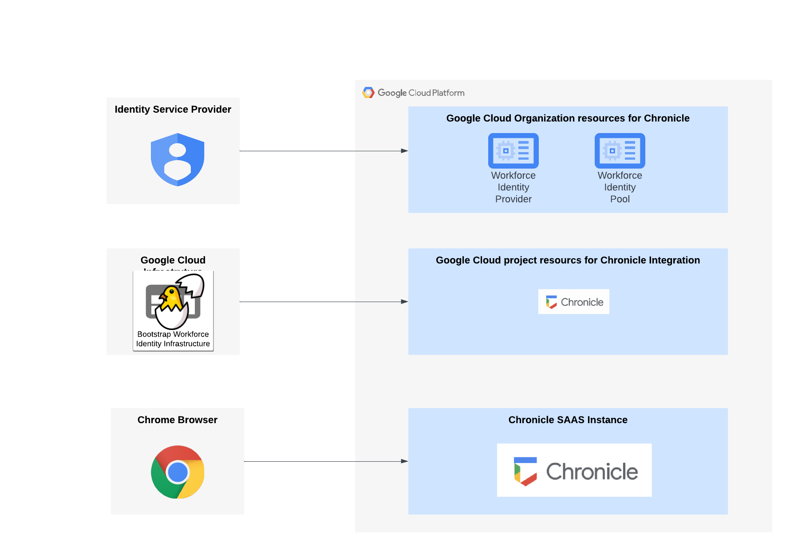

# terraform-google-chronicle-security-operations

This repository will deploy the required Google Cloud Infrastructure resources and integrate an identity provider with Workforce (aka employees) Identity Federation. In addition to the infrastructure deployment, UI screenshots will be provided when an API option does not exist.

## Demo Reference Architecture

The resources/services/activations/deletions that this module will create/trigger in dedicated project for Chronicle:
- Enable the required Google Cloud API Services
- Create a Workload Identity Pool 
- Create a Workload Identity Provider with unique attributes required for Chronicle Security Operations
- Update IAM policy to link Workforce members to Google Cloud role Chronicle Viewer
- Disable organizational policy conditions (aka guardrails) to allow the creation of Service Accounts and Keys
- Create a Service Account for Chronicle SOAR to connect to Google Cloud Organization
- Create a custom IAM role at the Organizational level
- Assign the Chronicle SOAR service account to the custom role at the Organization level

## Prerequisites

### Create a Google Cloud project 

Create a Google Cloud Project with [Project Factory](https://github.com/terraform-google-modules/terraform-google-project-factory) or an exiting pipeline for create Google Cloud projects.

### Create Custom SAML Application for Chronicle Authetication 

To autheticate into Chronicle a custom SAML application will be required to integrate into the Workforce Identity provider. The custom SAML application can be created in any identity provider such as Workspace, Okta, or Azure. However, in this example we will use the native Workspace option, but will show required attribues and groups required.

- Login to Google admin console. https://admin.google.com/

## Requirements

### Software

-   [gcloud sdk](https://cloud.google.com/sdk/install) >= 206.0.0
-   [Terraform](https://www.terraform.io/downloads.html) >= 0.13.0
-   [terraform-provider-google] plugin 3.50.x

### Permissions

- `roles/resourcemanager.organizationAdmin` on GCP Organization
- `roles/orgpolicy.policyAdmin` on GCP Organization
- `roles/billing.admin` on supplied billing account
- Account running terraform should be a member of group provided in `group_org_admins` variable, otherwise they will loose `roles/resourcemanager.projectCreator` access. Additional members can be added by using the `org_project_creators` variable.

gcloud iam service-accounts keys create - --iam-account="soar2googlecloud@prj-b-cicd-ogtp.iam.gserviceaccount.com"