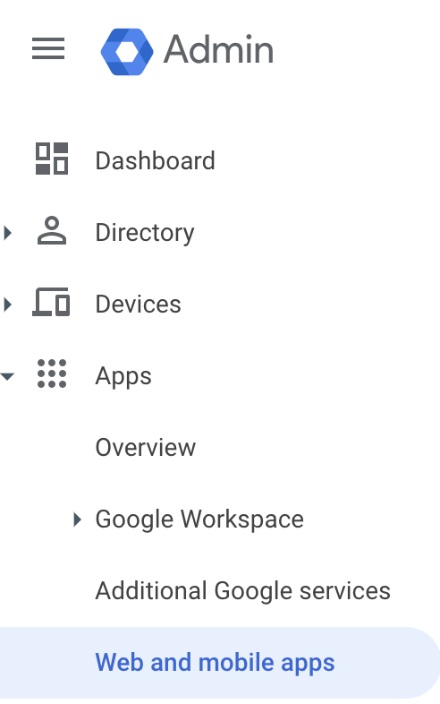
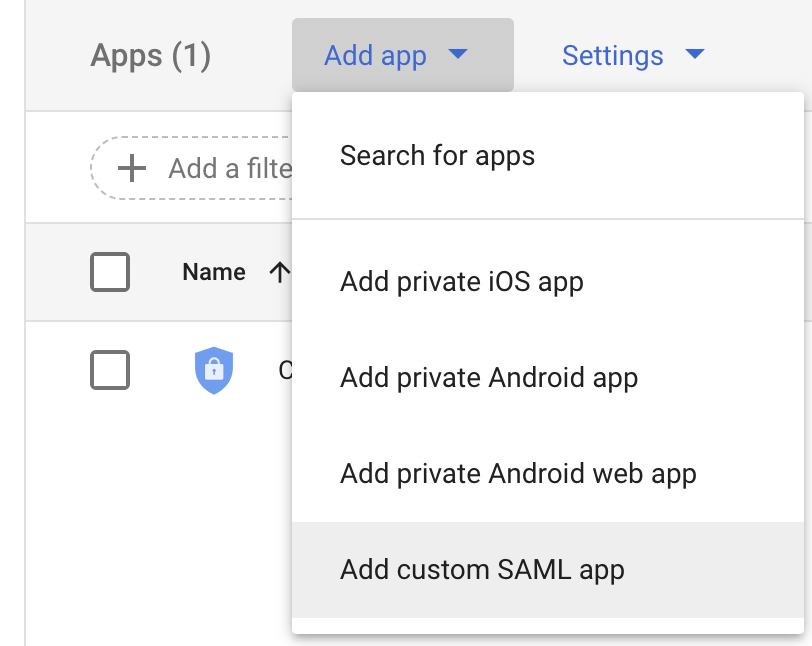
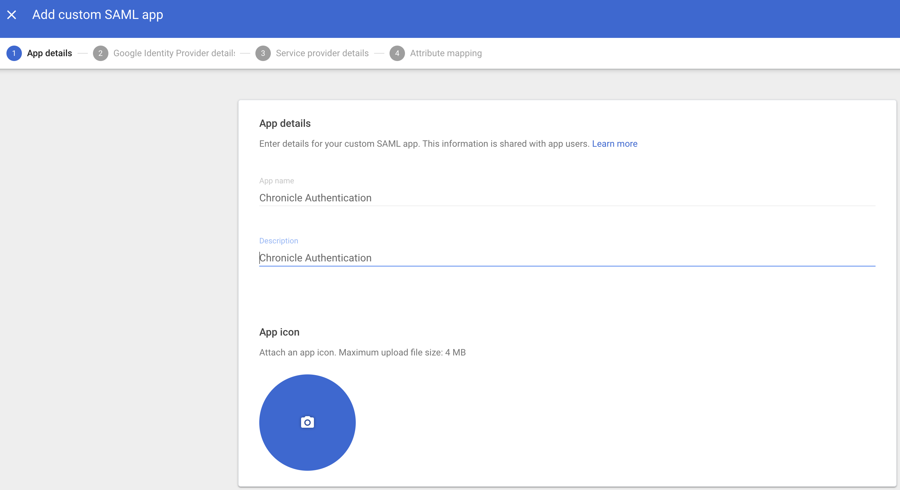
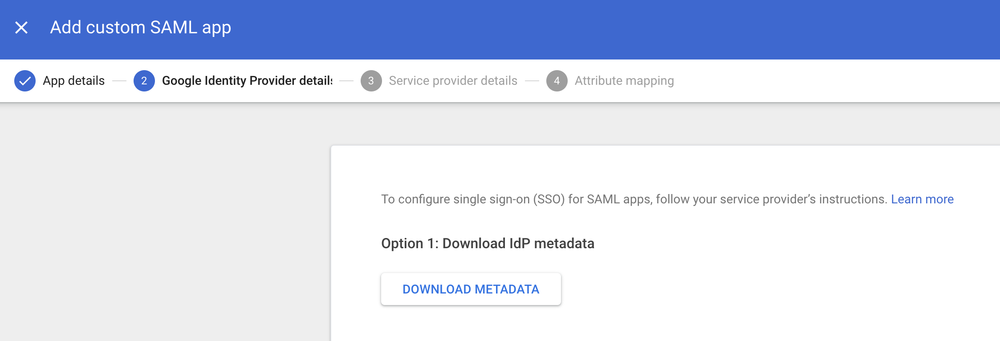
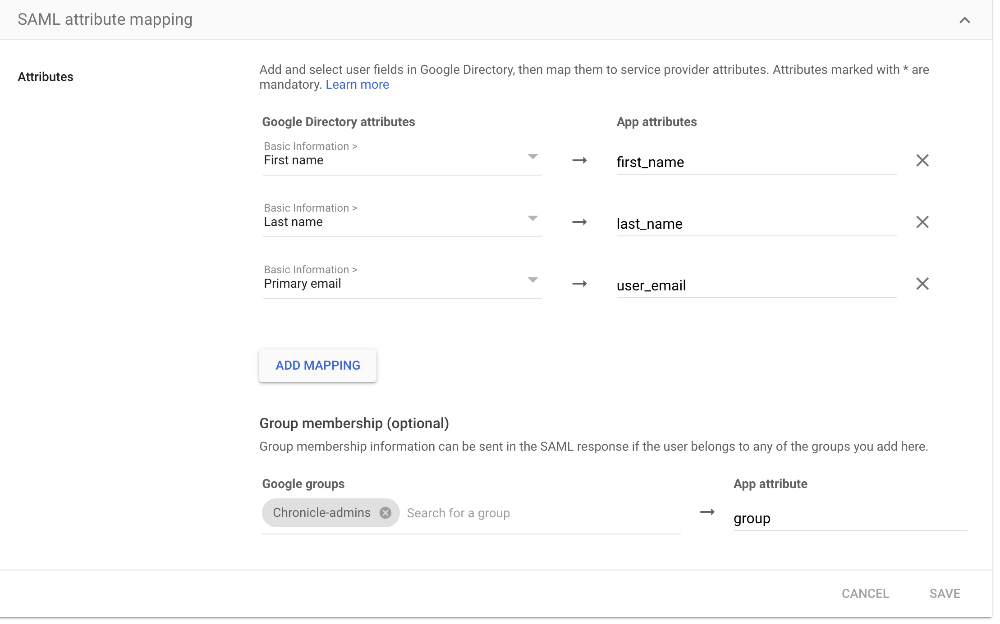
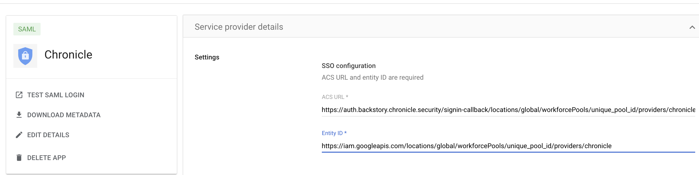

# terraform-google-chronicle-security-operations

This repository will deploy the required Google Cloud Infrastructure resources and integrate an identity provider with Workforce (aka employees) Identity Federation. In addition to the infrastructure deployment, UI screenshots will be provided when an API option does not exist.

## Demo Reference Architecture


The resources/services/activations/deletions that this module will create/trigger in dedicated project for Chronicle:
- Enable the required Google Cloud API Services
- Create a Workforce Identity Pool
- Create a Workforce Identity Provider with unique attributes required for Chronicle Security Operations
- Update IAM policy to link Workforce members to Google Cloud role Chronicle Viewer
- Disable organizational policy conditions (aka guardrails) to allow the creation of Service Accounts and Keys
- Create a Service Account for Chronicle SOAR to connect to Google Cloud Organization
- Create a custom IAM role at the Organizational level
- Assign the Chronicle SOAR service account to the custom role at the Organization level

## Prerequisites

### Create a Google Cloud project

Create a Google Cloud Project with [Project Factory](https://github.com/terraform-google-modules/terraform-google-project-factory) or an exiting pipeline for create Google Cloud projects.

### Create Custom SAML Application for Chronicle Authetication

To autheticate into Chronicle a custom SAML application will be required to integrate into the Workforce Identity provider. The custom SAML application can be created in any identity provider such as Workspace, Okta, or Azure. However, in this example we will use the native Workspace option, but will show required attribues and groups required.

1. Login to Google admin console. https://admin.google.com/

2. Go to Directory and Groups

3. Create a Google Group "Chronicle-admins" (Copy and paste name) and add members to the group

4. Go to Apps and click on Web and Mobile Apps


5. Click on add custom SAML app


6. Enter application details that calls out Chronicle Authentication


7. Download Metadata XML file for Workforce Integration


8. Enter placeholder (Unique Workforce pool id will be created in next step) values for ACS URL and Entity ID.
- ACS URL: https://auth.backstory.chronicle.security/signin-callback/locations/global/workforcePools/your_unique_workforce_pool_id/providers/chronicle
- Entity ID: https://iam.googleapis.com/locations/global/workforcePools/your_unique_workforce_pool_id/providers/chronicle


9. Update the attribues with the identical names (High rate of failure in this step).


### Alternative Identity providers
- [Okta Identity provider](/examples/okta/README.md)

## Usage

###
1. Clone repo
```
git clone https://github.com/jasonbisson/terraform-google-chronicle-security-operations.git
```

2. Rename and update required variables in terraform.tvfars.template
```
mv terraform.tfvars.template terraform.tfvars
#Update required variables
```

3. Execute Terraform commands with existing identity (human or service account) to build Workforce Identity Infrastructure.
```
cd ~/terraform-google-chronicle-security-operations/
terraform init
terraform plan
terraform apply
Copy the output of unique Workforce Pool ID to update the ACS & Entity values in Custom SAML app
```

4. Update ACS & Entity values of Custom SAML app with Workforce Pool ID in Google admin console. https://admin.google.com/




5. Create a Service Account Key for SOAR Service Account to access Google Cloud
```
export service_account_name=$(terraform  output -raw service_account)
export project_id=$(terraform  output -raw project_id)
gcloud iam service-accounts keys create - --iam-account="${service_account_name}"
```
<!-- BEGINNING OF PRE-COMMIT-TERRAFORM DOCS HOOK -->
## Inputs

| Name | Description | Type | Default | Required |
|------|-------------|------|---------|:--------:|
| activate\_apis | The list of apis to activate for Cloud Function | `list(string)` | <pre>[<br>  "sts.googleapis.com",<br>  "iamcredentials.googleapis.com",<br>  "cloudresourcemanager.googleapis.com",<br>  "iam.googleapis.com",<br>  "cloudasset.googleapis.com",<br>  "securitycenter.googleapis.com",<br>  "pubsub.googleapis.com",<br>  "compute.googleapis.com",<br>  "recommender.googleapis.com",<br>  "policyanalyzer.googleapis.com"<br>]</pre> | no |
| attribute\_mapping | attribute list | `map(string)` | n/a | yes |
| description | Description of the Pool | `string` | `"Chronicle Single Sign On"` | no |
| disable\_dependent\_services | Whether services that are enabled and which depend on this service should also be disabled when this service is destroyed. https://www.terraform.io/docs/providers/google/r/google_project_service.html#disable_dependent_services | `string` | `"false"` | no |
| disable\_services\_on\_destroy | Whether project services will be disabled when the resources are destroyed. https://www.terraform.io/docs/providers/google/r/google_project_service.html#disable_on_destroy | `string` | `"false"` | no |
| disabled | Enable the Workforce Pool | `bool` | `false` | no |
| display\_name | Display name of the Pool | `string` | `"Chronicle Single Sign On"` | no |
| enable\_apis | Whether to actually enable the APIs. If false, this module is a no-op. | `string` | `"true"` | no |
| idp\_metadata\_xml | How to print out in one string. Copy print\_metadata\_xml.py script under build directory to /tmp with your idp metadata file named GoogleIDPMetadata.xml. Run script to print out in one line | `string` | n/a | yes |
| location | Location of the Workforce Pool | `string` | n/a | yes |
| org\_id | The numeric organization id | `string` | n/a | yes |
| prefix | Prefix member or group or serviceaccount | `string` | `"principalSet"` | no |
| project\_id | Google Cloud Project where Workforce Identity pool and provider will be deployed | `any` | n/a | yes |
| role | IAM role for Chronicle Viewer | `string` | `"roles/chronicle.viewer"` | no |
| session\_duration | Session Duration | `string` | `"3600s"` | no |
| soar\_service\_account | Name of Service Account for SOAR to Google Cloud | `string` | `"soar2googlecloud"` | no |
| workforce\_pool\_id | workforce pool id | `string` | n/a | yes |
| workforce\_provider\_id | workforce provider id | `string` | n/a | yes |

## Outputs

| Name | Description |
|------|-------------|
| pool\_id | Pool id |
| pool\_name | Pool name |
| pool\_state | Pool state |
| project\_id | Name of Google Cloud Project ID for Chronicle resources |
| service\_account | Name of SOAR Service Account to access Google Cloud Organization |

<!-- END OF PRE-COMMIT-TERRAFORM DOCS HOOK -->

## Requirements

### Software

-   [gcloud sdk](https://cloud.google.com/sdk/install) >= 206.0.0
-   [Terraform](https://www.terraform.io/downloads.html) >= 0.13.0
-   [terraform-provider-google] plugin 3.50.x

### Required IAM Roles
- `roles/resourcemanager.organizationAdmin` on GCP Organization
- `roles/orgpolicy.policyAdmin` on GCP Organization
- `roles/iam.workforcePoolAdmin` Workforce Pool Admin
- `roles/iam.serviceAccountCreator` Create Service accounts and keys
- `roles/serviceusage.serviceUsageAdmin` Service Usage Admin

### Optional IAM Roles
- `roles/billing.user` to create Google Cloud project if needed
- `roles/resourcemanager.projectCreator` Project creator role

### Fine grain option

#### Fine grain Organization Permissions
- iam.roles.delete
- iam.roles.get
- iam.roles.undelete
- iam.roles.update
- iam.workforcePoolProviders.create
- iam.workforcePoolProviders.delete
- iam.workforcePoolProviders.get
- iam.workforcePools.create
- iam.workforcePools.delete
- iam.workforcePools.get
- resourcemanager.organizations.setIamPolicy

#### Fine grain Project Permissions
- iam.serviceAccounts.create
- iam.serviceAccounts.delete
- iam.serviceAccounts.get
- orgpolicy.policy.set
- resourcemanager.projects.setIamPolicy
- serviceusage.operations.get
- serviceusage.services.enable
- serviceusage.services.get
