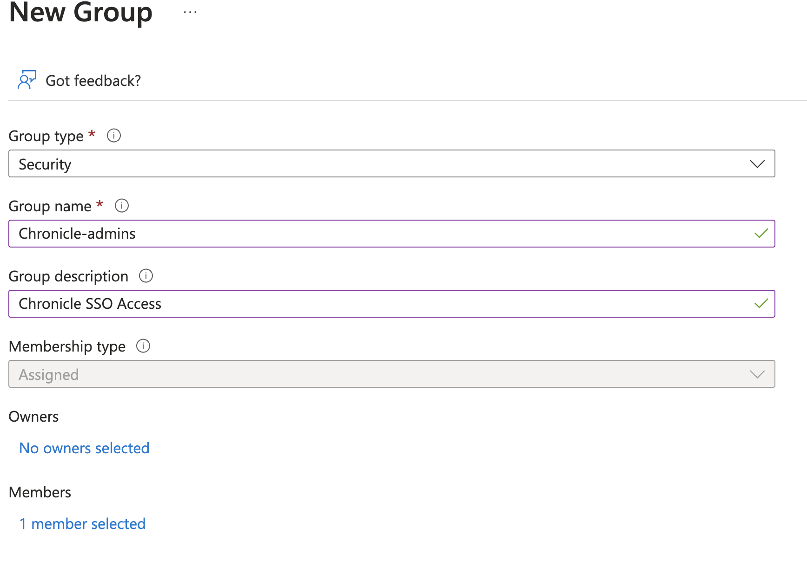
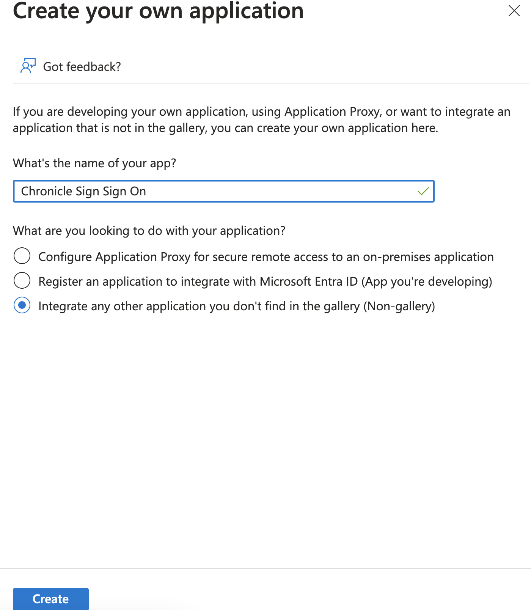
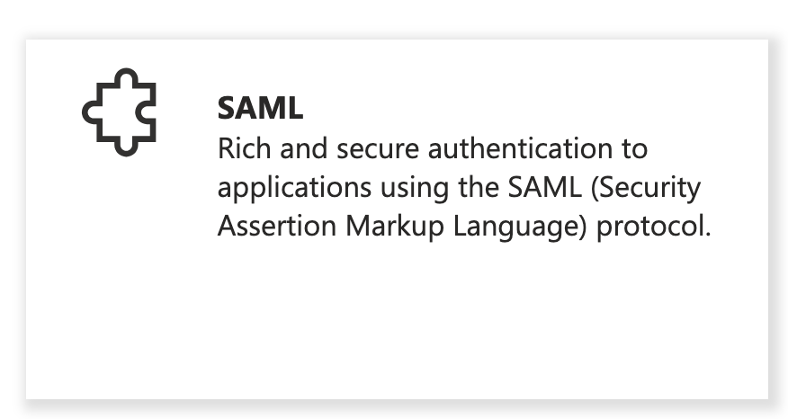
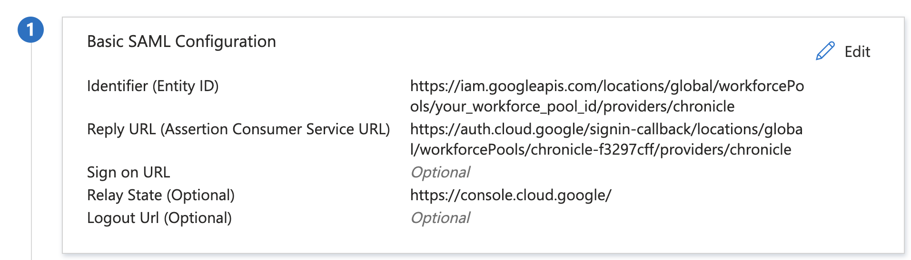
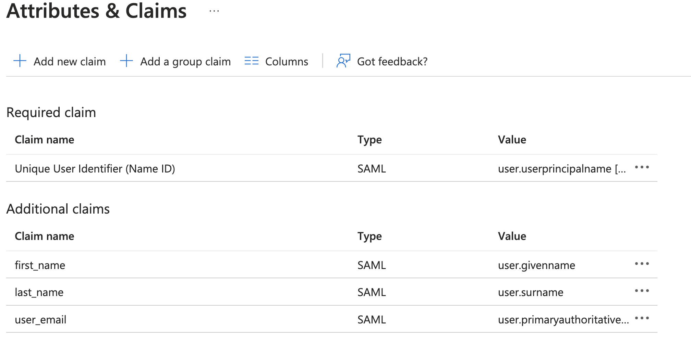
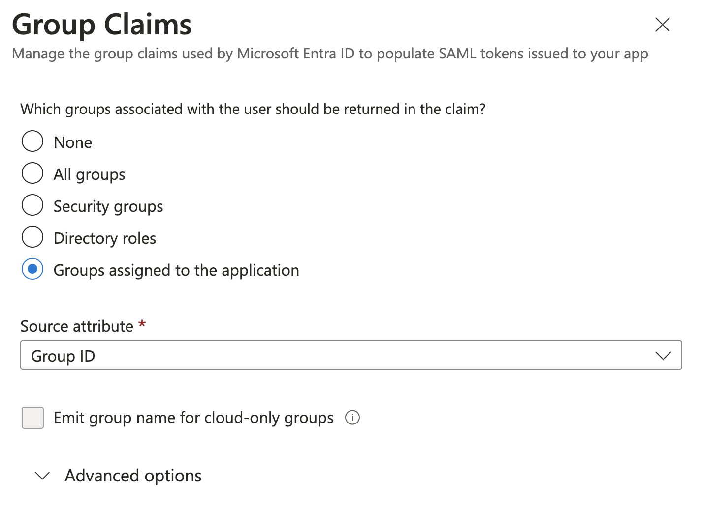
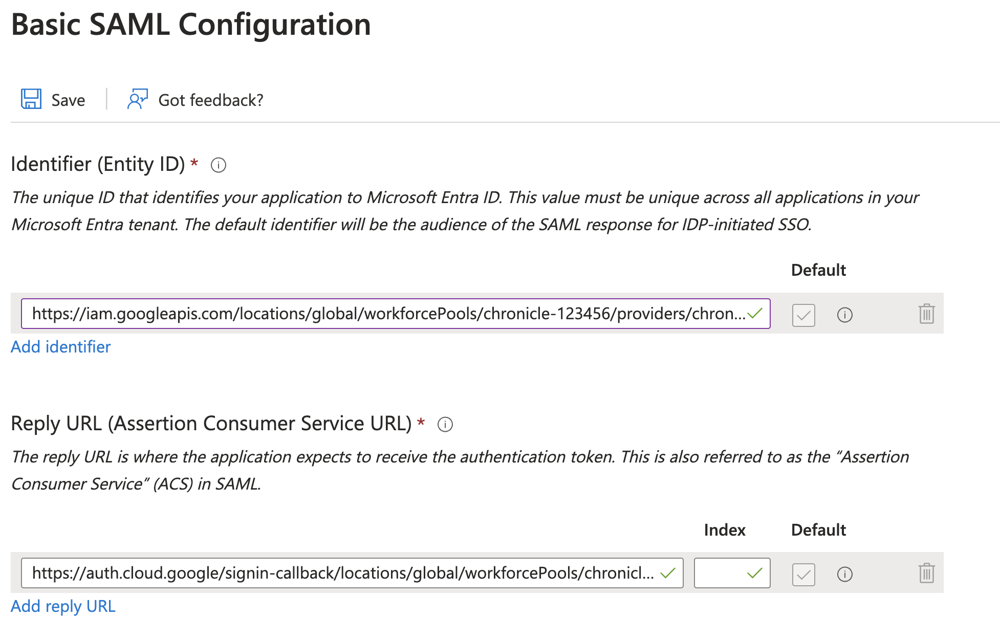

# Create Custom SAML Application for Chronicle Authetication

To autheticate into Chronicle a SAML application will be required to integrate into the Workforce Identity provider. The custom SAML application can be created in any identity provider such as Workspace, Okta, or Azure. However, in this example we will use the Okta option, but will show required attribues and groups required.

1. Login to Azure admin console. https://portal.azure.com/

2. Go to Microsoft Entra ID -> Groups -> New group

3. Create a Security Group "Chronicle-admins" (Copy and paste name) and add members to the group


4. Go to Microsoft Entra ID -> Enterprise applications -> Create your own application 


5. Click on Single Sign-on -> SAML


6. Enter placeholders (Unique Workforce pool id will be created in next step) values for Basic SAML.
- Identifier (Entity ID) : https://iam.googleapis.com/locations/global/workforcePools/your_unique_workforce_pool_id/providers/chronicle
- Reply URL (Assertion Consumer Service URL) : https://auth.backstory.chronicle.security/signin-callback/locations/global/workforcePools/your_unique_workforce_pool_id/providers/chronicle
- Relay State: https://console.cloud.google/


7. Update the attribues with the identical names (High rate of failure in this step).


8. Add a group claim -> Group Claims - Groups assigned to the application


9. Click on Enterprise Applications -> New Application you created above for Chronicle -> Add "Chronicle-Admins" group

10. Click on New Application you created above for Chronicle -> Sign Sign on -> Download Federation Metadata XML in SAML section


## Usage

###
1. Clone repo
```
git clone https://github.com/jasonbisson/terraform-google-chronicle-security-operations.git
```

2. Rename and update required variables in terraform.tvfars.template
```
mv terraform.tfvars.template terraform.tfvars
#Update required variables
```

3. Execute Terraform commands with existing identity (human or service account) to build Workforce Identity Infrastructure.
```
cd ~/terraform-google-chronicle-security-operations/
terraform init
terraform plan
terraform apply
Copy the output of unique Workforce Pool ID to update the ACS & Entity values in Azure Enterprise Application
```
4. Update Azure Enterprise Application with unique Workforce pool id values for Single sign-on URL and Audience URI (SP Entity ID)



