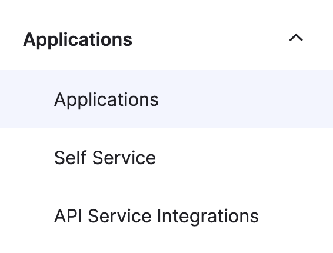
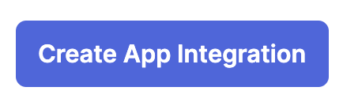
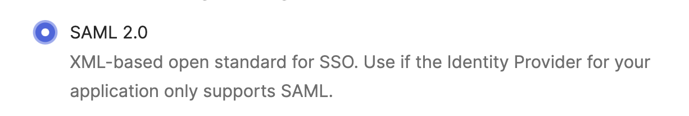
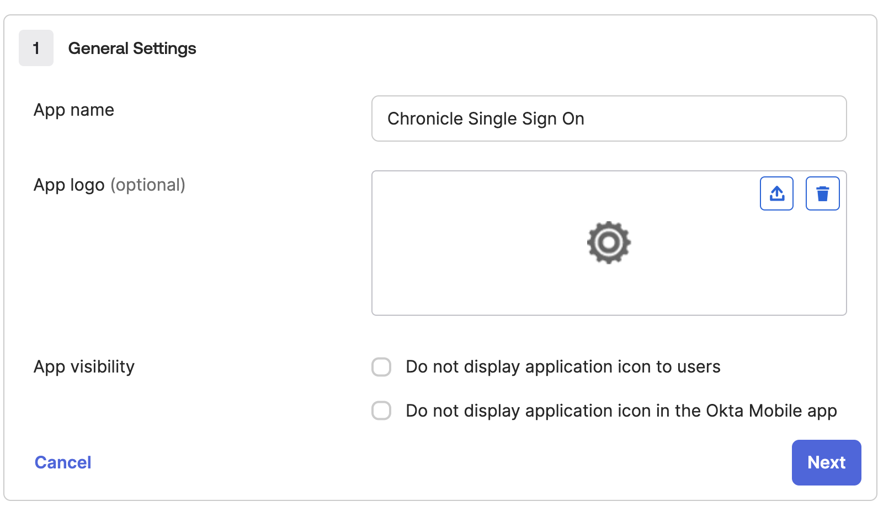
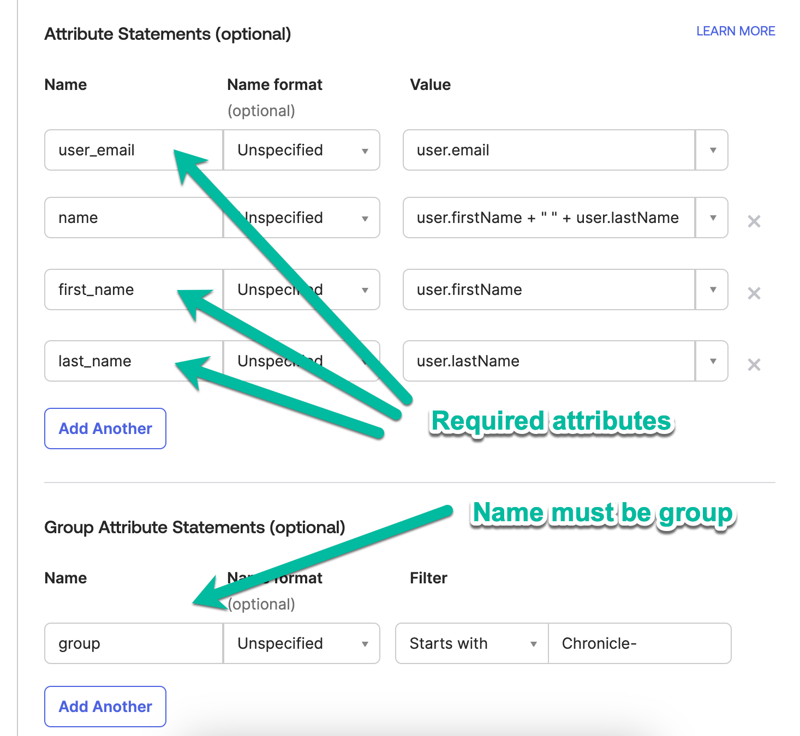

# Create Custom SAML Application for Chronicle Authetication 

To autheticate into Chronicle a custom SAML application will be required to integrate into the Workforce Identity provider. The custom SAML application can be created in any identity provider such as Workspace, Okta, or Azure. However, in this example we will use the native Workspace option, but will show required attribues and groups required.

1. Login to Okta admin console. https://<Your Okta Instance>>.okta.com/admin/dashboard

2. Go to Directory -> Groups

3. Create a Google Group "Chronicle-admins" (Copy and paste name) and add People to the group

4. Go to Applications and click on Applications


5. Click on Create App Integration


6. Click on SAML 2.0 and next


7. Update the name and icon for the application


8. Enter placeholder (Unique Workforce pool id will be created in next step) values for ACS URL and Entity ID. 
- ACS URL: https://auth.backstory.chronicle.security/signin-callback/locations/global/workforcePools/your_unique_workforce_pool_id/providers/chronicle
- Entity ID: https://iam.googleapis.com/locations/global/workforcePools/your_unique_workforce_pool_id/providers/chronicle


9. Update the attribues with the identical names (High rate of failure in this step).


## Usage

### 
1. Clone repo
```
git clone https://github.com/jasonbisson/terraform-google-chronicle-security-operations.git
```

2. Rename and update required variables in terraform.tvfars.template
```
mv terraform.tfvars.template terraform.tfvars
#Update required variables
```

3. Execute Terraform commands with existing identity (human or service account) to build Workforce Identity Infrastructure.
```
cd ~/terraform-google-chronicle-security-operations/
terraform init
terraform plan
terraform apply
Copy the output of unique Workforce Pool ID to update the ACS & Entity values in Custom SAML app
```

4. Update ACS & Entity values of Custom SAML app with Workforce Pool ID in Google admin console. https://admin.google.com/


