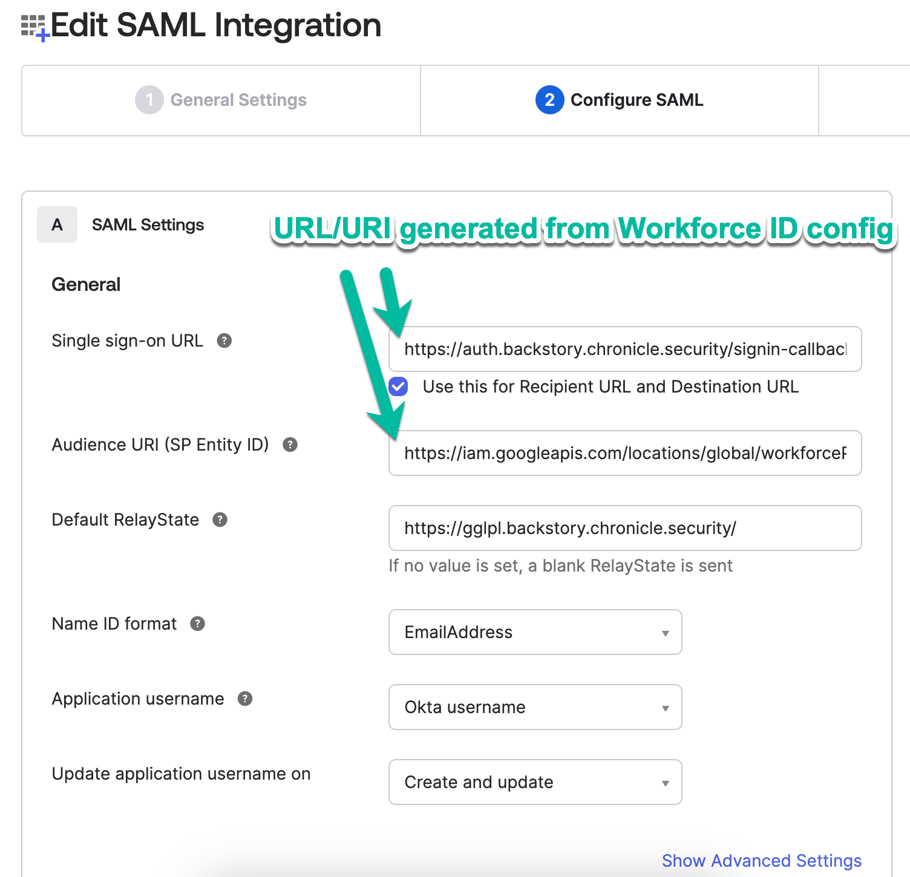
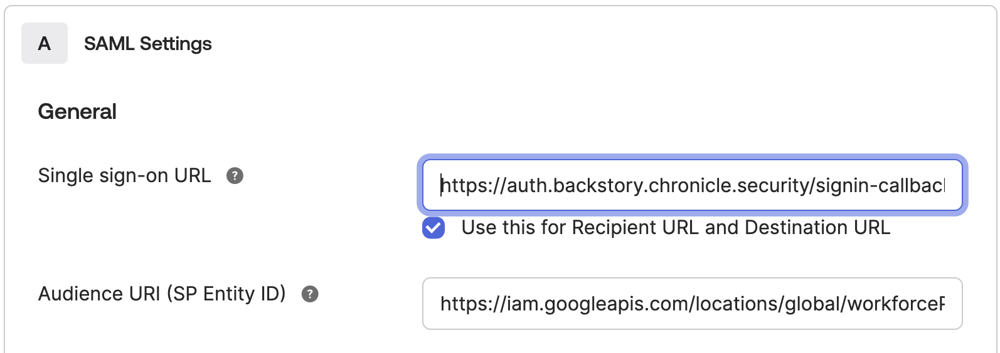

# Create Custom SAML Application for Chronicle Authetication 

To autheticate into Chronicle a SAML application will be required to integrate into the Workforce Identity provider. The custom SAML application can be created in any identity provider such as Workspace, Okta, or Azure. However, in this example we will use the Okta option, but will show required attribues and groups required.

1. Login to Okta admin console. https://<Your Okta Instance>>.okta.com/admin/dashboard

2. Go to Directory -> Groups

3. Create a Okta Group "Chronicle-admins" (Copy and paste name) and add People to the group

4. Go to Applications and click on Applications


5. Click on Create App Integration


6. Click on SAML 2.0 and next


7. Update the name and icon for the application


8. Enter placeholders (Unique Workforce pool id will be created in next step) values for Single sign-on URL and Audience URI (SP Entity ID). 
- Single sign-on URL: https://auth.backstory.chronicle.security/signin-callback/locations/global/workforcePools/your_unique_workforce_pool_id/providers/chronicle
- Audience URI (SP Entity ID): https://iam.googleapis.com/locations/global/workforcePools/your_unique_workforce_pool_id/providers/chronicle


9. Update the attribues with the identical names (High rate of failure in this step).


10. Save application -> Click Sign On -> Click on view SAML setup instructions on right side


11. Assigned Chronicle-admins group to the new application


12. Copy IDP metadata for variable idp_metadata_xml in terraform.tfvars.


## Usage

### 
1. Clone repo
```
git clone https://github.com/jasonbisson/terraform-google-chronicle-security-operations.git
```

2. Rename and update required variables in terraform.tvfars.template
```
mv terraform.tfvars.template terraform.tfvars
#Update required variables
```

3. Execute Terraform commands with existing identity (human or service account) to build Workforce Identity Infrastructure.
```
cd ~/terraform-google-chronicle-security-operations/
terraform init
terraform plan
terraform apply
Copy the output of unique Workforce Pool ID to update the ACS & Entity values in Custom SAML app
```
4. Update Okta app with unique Workforce pool id values for Single sign-on URL and Audience URI (SP Entity ID)



